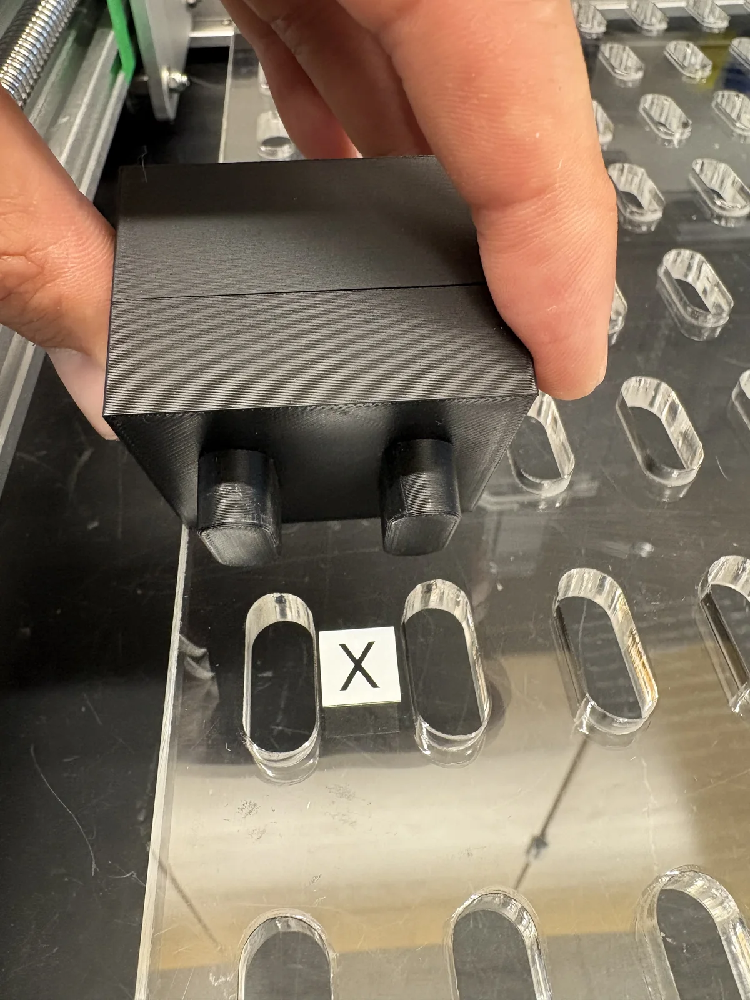
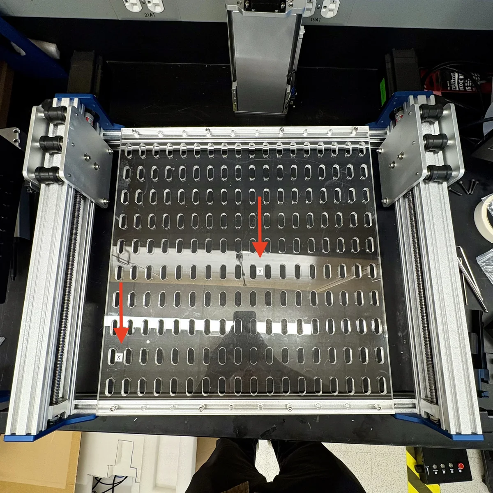
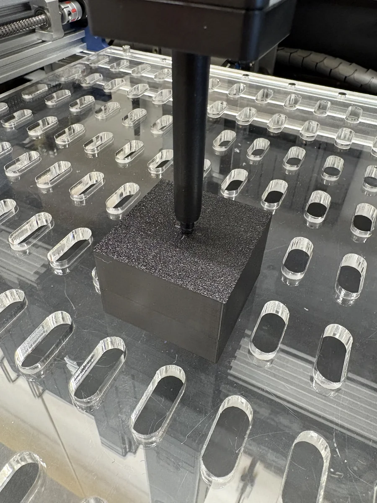
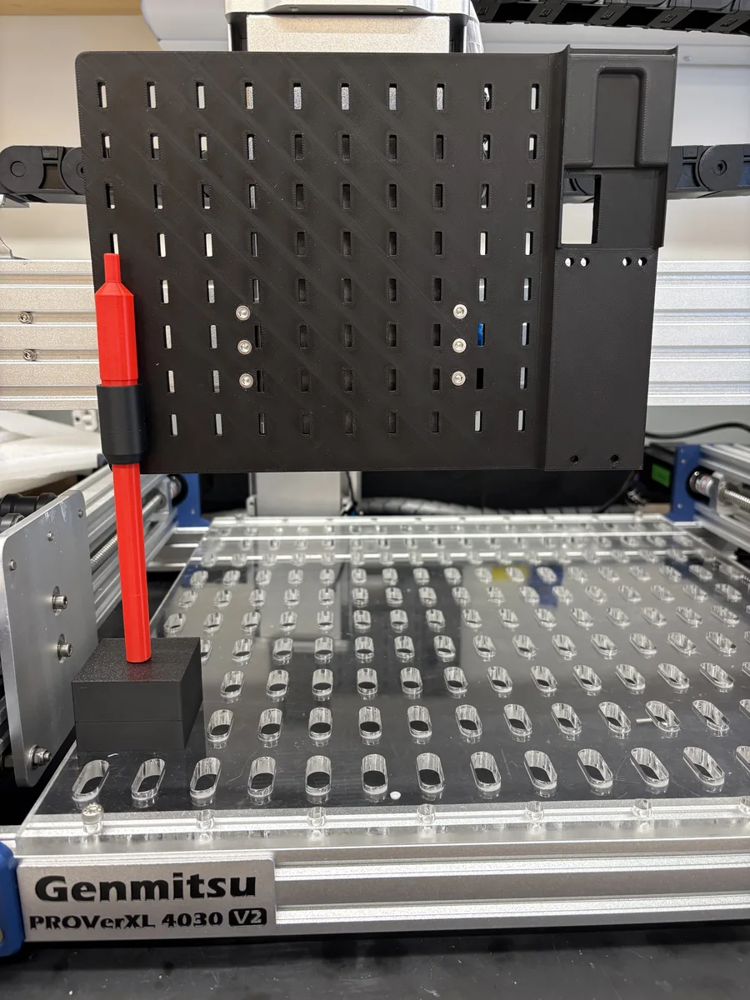
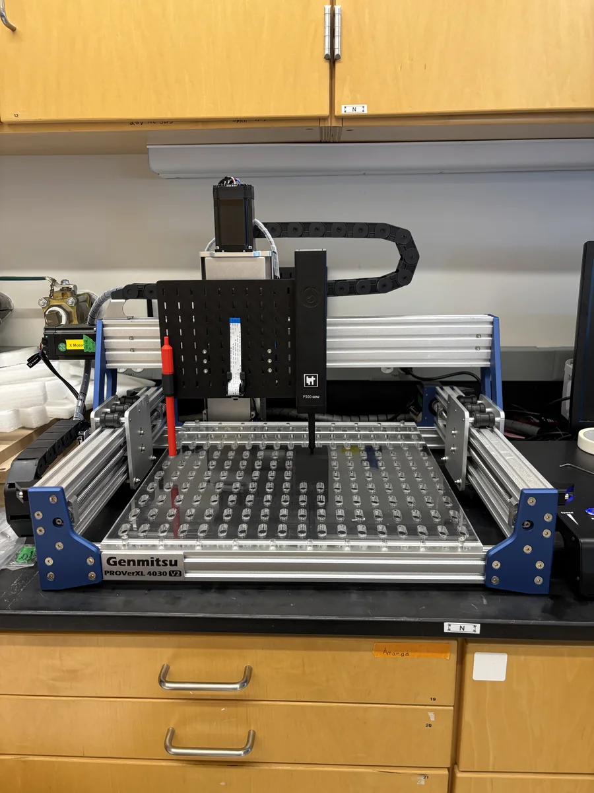

# Calibration

Use `setup/calibrate_gantry.py` for gantry calibration. It reads one gantry
YAML file, detects the mounted instruments, selects the single- or
multi-instrument flow, and writes calibrated values back to YAML.

Calibration moves hardware and can update work coordinates and GRBL soft-limit
travel settings. Keep the E-stop reachable and clear the deck before starting.

## Before You Start

1. Turn on the gantry and controller.
2. Connect the gantry to the computer over USB/serial.
3. Make sure mounted instruments, cables, fixtures, and samples have clear
   travel paths.
4. Confirm the gantry YAML has the correct `cnc.factory_z_travel_mm` and
   mounted `instruments`. The YAML schema still requires `serial_port`, but
   calibration connects through the gantry driver's serial auto-scan.
5. Confirm the gantry YAML's `gantry_type` (`cub` or `cub_xl`) matches your
   physical unit — CUB and CUB XL have different working volumes and travel
   limits (see [Gantry: CNC Fields](gantry.md#cnc-fields)). Calibrating with
   the wrong `gantry_type` config produces a wrong working volume.
6. Put the calibration block and any board placement markers within reach.

{ width="420" }

{ width="520" }

!!! warning "Close other GRBL software first"
    Close Candle, Universal Gcode Sender (UGS), or any other GRBL sender
    before running calibration. A serial port can only be held open by one
    program at a time — if another program still has it open, calibration
    will fail to connect, or lose control of the gantry mid-run.

## Multi-CUB Serial Ports

`calibrate_gantry.py` connects by auto-scan and has no option to target a
specific serial port — it connects to whichever GRBL device answers first
among everything plugged in. If more than one CUB is connected to the same
computer, there is currently no way to guarantee it picks the one you mean.

!!! warning "Only connect the CUB you're calibrating"
    Until CubOS supports pinning a connection to a specific device, physically
    disconnect every other CUB before calibrating one of them. Identifying
    serial numbers (below) doesn't feed into calibration today — it's for
    labeling your units and confirming which is which, so this stays
    reliable as you scale past one CUB.

List every connected GRBL device along with its USB serial number:

```bash
python -m serial.tools.list_ports -v
```

Match the serial number in the output to the unit you're calibrating. Label
each CUB's serial number physically (e.g. a sticker on the controller
enclosure) the first time you identify it, so you don't have to repeat this.

If two devices look identical and the serial number alone doesn't tell you
which is which, unplug the one you want to identify and re-run the command —
the port that disappears is the one you unplugged:

```bash
python -m serial.tools.list_ports -v
# unplug the CUB you're trying to identify, then:
python -m serial.tools.list_ports -v
# the port that's now missing belongs to that CUB
```

## Run Calibration

To calibrate in place, run:

- **macOS / Linux / Windows (Git Bash):**
  ```bash
  PYTHONPATH=src python setup/calibrate_gantry.py configs/gantry/cub_xl_asmi.yaml
  ```
- **Windows (PowerShell):**
  ```powershell
  $env:PYTHONPATH = "src"
  python setup/calibrate_gantry.py configs/gantry/cub_xl_asmi.yaml
  ```

The script asks before overwriting the input file. To write a calibrated copy:

- **macOS / Linux / Windows (Git Bash):**
  ```bash
  PYTHONPATH=src python setup/calibrate_gantry.py \
    configs/gantry/cub_xl_sterling_3_instrument.yaml \
    --output-gantry configs/gantry/cub_xl_sterling_3_instrument_calibrated.yaml
  ```
- **Windows (PowerShell):**
  ```powershell
  $env:PYTHONPATH = "src"
  python setup/calibrate_gantry.py `
    configs/gantry/cub_xl_sterling_3_instrument.yaml `
    --output-gantry configs/gantry/cub_xl_sterling_3_instrument_calibrated.yaml
  ```

The preflight shows the input file, output file, detected instruments, and the
chosen flow before it connects to hardware.

## Jog Controls

During calibration:

- arrow keys jog X/Y
- `X` jogs `+Z` up
- `Z` jogs `-Z` down
- number keys change step size
- Enter confirms the current step
- `Q` aborts

!!! warning "Single presses only — do not hold jog keys down"
    Press a jog key once and wait for the move to finish before pressing
    again. Holding a key down queues multiple jog commands; the gantry keeps
    executing queued moves after you release the key and will overshoot past
    where you meant to stop.

If a jog trips a hard limit, CubOS soft-resets, unlocks GRBL, and attempts a
small pull-off opposite the failed jog direction. Stop and reset the controller
if recovery fails.

## Single-Instrument Calibration

Use this flow when the gantry YAML has one mounted instrument.

1. Start `setup/calibrate_gantry.py`.
2. Confirm the single-instrument flow in the preflight.
3. Place the calibration block at the front-left origin reference point.
4. Jog the instrument tip or probe until it touches the top of the block.
5. Confirm the touch point when prompted.
6. Let the script home and measure the usable work volume.
7. Review the summary and calibrated YAML path.

{ width="420" }

The script saves the deck-frame working volume, preserves
`cnc.factory_z_travel_mm` as the factory safety bound, and writes
`cnc.calibration_block_height_mm` from the prompted block height. If
`grbl_settings.homing_pull_off` is configured, GRBL max travel values include
that pull-off reserve.

## Multi-Instrument Calibration

Use this flow when the gantry YAML has more than one mounted instrument.

1. Start `setup/calibrate_gantry.py`.
2. Confirm the multi-instrument flow in the preflight.
3. Select the leftmost/reference instrument when prompted.
4. Select the lowest instrument when prompted.
5. Place the first calibration block on the leftmost board mark for the red
   reference instrument.

   { width="420" }

6. Jog the red reference instrument to touch the first block.
7. Move the calibration block to the center board mark.

   { width="520" }

8. Jog each remaining instrument to the shared center reference point as
   prompted.
9. For an RPi camera, center the camera over the same block mark, press Enter,
   then measure and enter the height from the calibration block top to the
   camera reference point.
10. For pipette setups, jog the pipette to the center reference point on the
   block when prompted.
11. Let the script compute `offset_x`, `offset_y`, and `depth` for each
   instrument.
12. Review the summary and calibrated YAML path.

## Interactive Jog Test

After calibration, run the interactive deck-frame jog check:

```bash
PYTHONPATH=src python setup/hello_world.py \
  --gantry configs/gantry/cub_xl_asmi.yaml
```

Expected directions:

- `+X` moves right
- `+Y` moves back, away from the operator
- `+Z` moves up
- `-Z` moves down

Once calibration and the jog test are complete, continue to
[Set Up Deck and Labware](deck.md).
