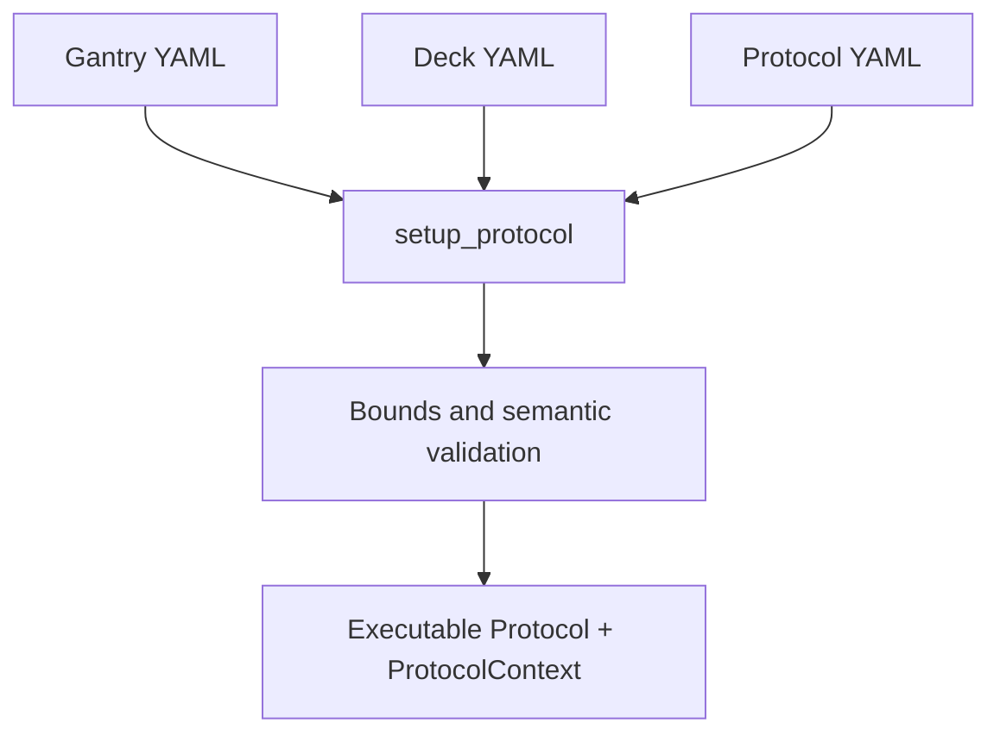

# Configuration

CubOS runs from three YAML inputs:

```text
configs/
  gantry/      # machine envelope, GRBL expectations, mounted instruments
  deck/        # labware placement and calibration anchors
  protocol/    # ordered experiment steps
```



Use the CubOS deck frame in every file:

- origin: front-left-bottom reachable work volume
- `+X`: operator-right
- `+Y`: back, away from the operator
- `+Z`: up, away from the deck

Do not pre-flip signs in YAML. GRBL settings and calibration must make WPos
match this frame.

## Gantry YAML

Gantry YAML describes the machine and mounted instruments.

```yaml
serial_port: /dev/ttyUSB0
gantry_type: cub_xl
cnc:
  homing_strategy: standard
  factory_z_travel_mm: 110.0
  calibration_block_height_mm: 35.0
  y_axis_motion: head
  safe_z: 85.0
working_volume:
  x_min: 0.0
  x_max: 386.0
  y_min: 0.0
  y_max: 250.0
  z_min: 0.0
  z_max: 87.0
grbl_settings:
  status_report: 0
  homing_enable: true
  homing_pull_off: 10.0
  max_travel_x: 396.0
  max_travel_y: 260.0
  max_travel_z: 97.0
instruments:
  asmi:
    type: asmi
    vendor: vernier
    offset_x: 0.0
    offset_y: 0.0
    depth: 0.0
```

Important fields:

| Field | Meaning |
| --- | --- |
| `serial_port` | Serial device used by the GRBL controller. |
| `gantry_type` | Machine family: `cub` or `cub_xl`. `cub_xl` enables the fixed right-rail guard during validation. |
| `cnc.homing_strategy` | Currently `standard`, which runs GRBL `$H`. |
| `cnc.factory_z_travel_mm` | Factory vertical travel safety bound; calibration preserves it. |
| `cnc.calibration_block_height_mm` | Calibration block height used by gantry calibration. |
| `cnc.safe_z` | Absolute deck-frame travel ceiling. Defaults to `working_volume.z_max` when omitted. |
| `working_volume` | Usable deck/WPos bounds after homing pull-off. |
| `grbl_settings` | Expected GRBL `$` settings. Max travel fields include the `$27` pull-off reserve. |
| `instruments` | Mounted instruments, offsets, depth, and driver-specific connection fields. |

Instrument blocks carry physical mounting state only. Protocol engagement
heights such as `measurement_height` and `interwell_scan_height` belong in
the protocol YAML, not under `instruments`.

## Deck YAML

Deck YAML describes physical labware and collision-relevant fixtures.

```yaml
labware:
  plate:
    load_name: sbs_96_wellplate
    name: asmi_96_well_deck_origin
    model_name: asmi_96_well_deck_origin
    calibration:
      a1: { x: 347.0, y: 42.0, z: 30.0 }
      a2: { x: 338.0, y: 42.0, z: 30.0 }
    x_offset: 9.0
    y_offset: 9.0
```

Supported labware entries include:

- `well_plate` - two-point A1/A2 calibration, generated wells
- `tip_rack` - two-point calibration, tip occupancy, `tip_length`
- `vial` - one fixed `location`
- `well_plate_holder` - physical holder that can contain a nested plate
- `vial_holder` - physical holder that can contain nested vials
- `tip_disposal` - disposal geometry for used tips
- `wall` - rectangular obstacle from two opposite corners

Important rules:

- A1/A2 calibration must be axis-aligned; diagonal A2 is rejected.
- Well plates, tip racks, and holders take their surface/reference Z from
  calibration anchors.
- Vials and holders take their reference Z from `location.z`.
- Nested labware derives Z from the holder seat; do not provide nested
  calibration `z` values.
- `height` is the physical outer dimension, not a shortcut for a Z reference.
- `load_name` expands a built-in definition from
  `src/deck/labware/definitions/`; user fields override the template.

## Protocol YAML

Protocol YAML defines the ordered steps that run against the loaded gantry and
deck.

```yaml
positions:
  park_position: [360.0, 250.0, 85.0]

protocol:
  - home:
  - scan:
      plate: plate
      instrument: asmi
      method: indentation
      measurement_height: -1.0
      interwell_scan_height: 8.0
      indentation_limit_height: -5.0
      method_kwargs:
        step_size: 0.1
        force_limit: 10.0
  - move:
      instrument: asmi
      position: park_position
      travel_z: 85.0
```

Registered YAML commands:

| Command | Purpose |
| --- | --- |
| `home` | Home the gantry without redefining calibrated WPos. |
| `move` | Move an instrument to a named, literal, or deck position. |
| `measure` | Move to one deck position and call an instrument method. |
| `scan` | Iterate every well on a plate and call an instrument method. |
| `pause` | Sleep for a fixed number of seconds. |
| `breakpoint` | Wait for operator input. |
| `pick_up_tip`, `aspirate`, `transfer`, `serial_transfer`, `mix`, `blowout`, `drop_tip` | Pipette workflow commands. |

Height fields on engaging commands are labware-relative offsets from the
resolved well/labware reference Z:

- `measurement_height`: action plane; required on `measure` and `scan`
- `interwell_scan_height`: between-well travel plane; required on `scan`
- `indentation_limit_height`: ASMI deepest descent plane; signed, often
  negative, and must be at or below `measurement_height`
- pipette `height`, `source_height`, and `destination_height`: optional
  labware-relative engagement offsets

Inter-labware travel uses the gantry's absolute `safe_z`. Protocol
`positions:` entries are named absolute XYZ targets, not deck labware.

## Editing Rule

If the hardware has not moved, edit the protocol YAML. Change deck YAML only
when labware placement changes. Change gantry YAML only for machine,
calibration, GRBL, or mounted-instrument changes.
