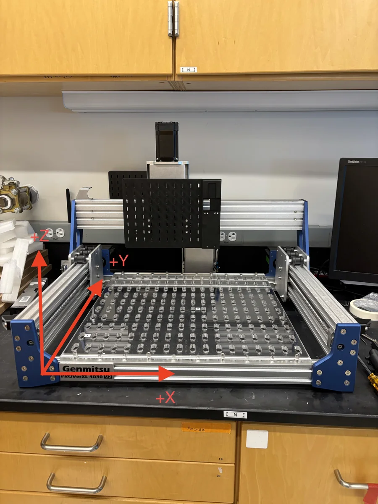

# YAML File Overview

CubOS runs from three YAML inputs:

```text
configs/
  gantry/      # machine envelope, GRBL expectations, mounted instruments
  deck/        # labware placement and calibration anchors
  protocol/    # ordered experiment steps
```

Use this page as a routing guide. The operator workflow pages carry the
detailed instructions.

| File | Edit it when | Primary docs |
| --- | --- | --- |
| Gantry YAML | Machine limits, GRBL expectations, or mounted instruments change. | [Calibrate Gantry](calibration.md) |
| Deck YAML | Labware, fixtures, holders, or labware positions change. | [Set Up Deck and Labware](deck.md) |
| Protocol YAML | Experimental steps, target wells, method arguments, or motion heights change. | [Run a Protocol with YAML](protocol-yaml.md) |

Use the CubOS deck frame in every file:

- origin: front-left-bottom reachable work volume
- `+X`: operator-right
- `+Y`: back, away from the operator
- `+Z`: up, away from the deck

Do not pre-flip signs in YAML. GRBL settings and calibration make the
controller coordinates match this frame.

{ width="520" }
