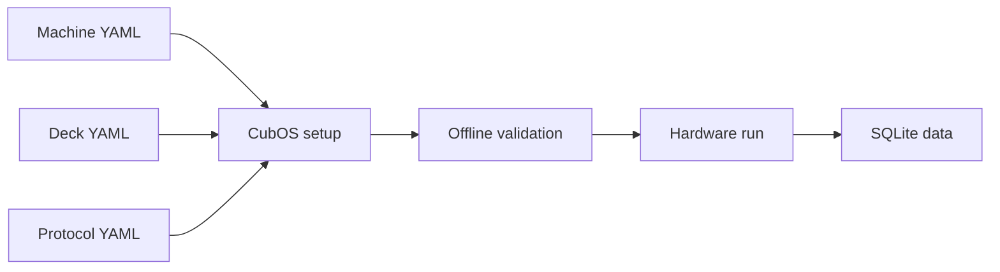

# Home

CubOS is a Python control layer for CNC-based lab automation. It combines a
GRBL gantry, mounted instruments, deck labware, YAML protocols, offline motion
validation, and local SQLite data storage into one workflow.

CubOS is used to:

- define machine, deck, and protocol state in versioned YAML files
- calibrate the gantry into a front-left-bottom deck frame
- validate reach, motion bounds, command semantics, and collision constraints
- execute protocols against real hardware
- persist experiment state and instrument measurements for later analysis

## Contents

| Section | Use it for |
| --- | --- |
| [Getting Started](getting-started.md) | Install CubOS and understand when gantry bring-up is needed. |
| [Calibration](calibration.md) | Calibrate the gantry and run the interactive jog check. |
| [Configuration](configuration.md) | Author gantry, deck, and protocol YAML files. |
| [Running a Protocol](protocol.md) | Validate and run a protocol from YAML. |
| [Data](data.md) | Understand persistence, read helpers, and CSV export. |
| [API Reference](reference/index.md) | Inspect generated Python API docs. |

## Coordinate Frame

CubOS uses the deck frame everywhere above the GRBL boundary:

- origin: front-left-bottom reachable work volume
- `+X`: operator-right
- `+Y`: back, away from the operator
- `+Z`: up, away from the deck

High-level code does not pre-flip signs. Controller direction, homing direction,
and work-coordinate setup must make GRBL WPos match this frame.
