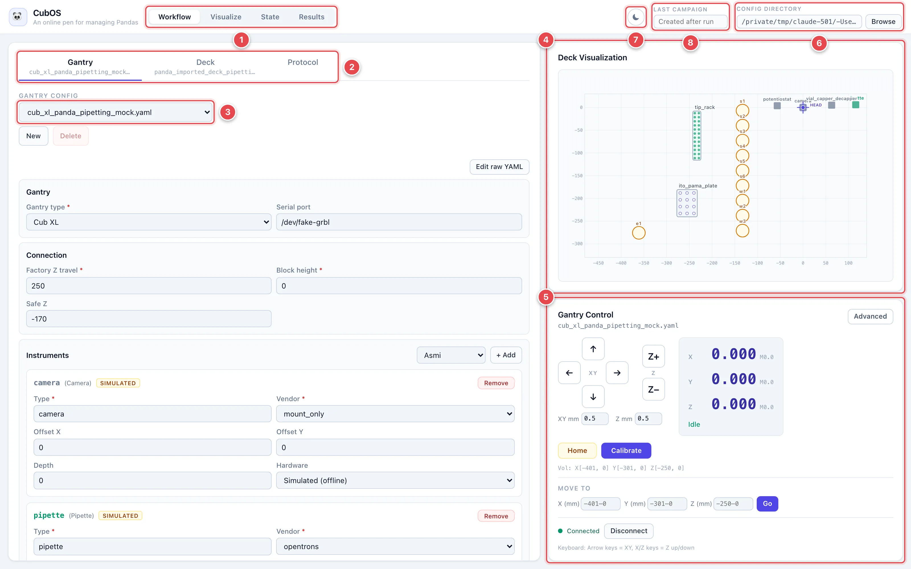

# Use the Operator UI

The Operator UI is CubOS's browser app. It lets you connect to the gantry,
move it with on-screen buttons, calibrate the machine and its labware, build
and run protocols, and download results — all without touching a terminal or
editing YAML by hand.

Everything in this guide happens in a normal web browser. If you can fill in
a web form, you can drive CubOS.

This page covers starting the app and finding your way around it. The
step-by-step tasks each have their own page:

| Task | Page |
|---|---|
| Load a machine config, connect, home, and jog | [Gantry: Connect and Move](operator-ui/gantry.md) |
| Calibrate the gantry's origin and instruments | [Calibrate the Gantry](operator-ui/calibrate-gantry.md) |
| Define labware on the deck and calibrate its positions | [Deck and Labware](operator-ui/deck-and-labware.md) |
| Build, validate, and run a protocol | [Protocols](operator-ui/protocols.md) |
| Download measurements and inspect liquid state | [Results and State](operator-ui/results-and-state.md) |

Every screenshot in these pages is annotated with numbered markers. The list
under each picture explains what each marker points at.

## Start the Operator UI

If you are using a preinstalled CubOS appliance, the Operator UI is already
running — open a browser on the lab computer and go to the address your
administrator gave you (by default it is `http://127.0.0.1:8742` on the
machine itself).

To start it yourself on the computer connected to the gantry:

!!! note "Prerequisite"
    The UI server is a separate package from the CubOS core. If you haven't
    yet, install it into the same virtual environment (from the repository
    root, with the venv activated):

    ```bash
    python -m pip install -e services/api
    ```

    Otherwise `python -m cubos_api` fails with `No module named cubos_api`.
    It requires Python 3.11+.

!!! note "Prerequisite: build the web app once"
    The browser interface is compiled from `apps/operator-web/`. If the
    server starts but logs `compiled web assets were not found` and the
    browser shows **404 Not Found**, install
    [Node.js 20 LTS or newer](https://nodejs.org) and build it (from the
    repository root):

    ```bash
    cd apps/operator-web
    npm ci
    npm run build
    cd ../..
    ```

    Then start `python -m cubos_api` again — it only picks up the compiled
    assets at startup. See
    [Build the Operator UI](getting-started.md#build-the-operator-ui-browser-app)
    for details.

With the virtual environment active — in every new terminal, re-run the
[activation command](getting-started.md#installation) for your platform
(e.g. `source .venv/bin/activate`) — start the server from the repository
root:

```bash
python -m cubos_api
```

Your browser opens automatically at `http://127.0.0.1:8742` after a moment.
Leave the terminal window running; closing it stops the app.

### Running on a Raspberry Pi? Forward the port over SSH

When CubOS runs on a Raspberry Pi (or any other machine without a monitor),
the Operator UI is only reachable *on that machine* — for safety, the app
only accepts local connections out of the box. The easiest way to use it
from your own laptop is an SSH tunnel: one command that securely forwards
the Pi's port 8742 to your laptop.

In a terminal on your laptop (macOS/Linux Terminal, or PowerShell on
Windows 10+), run:

```bash
ssh -L 8742:127.0.0.1:8742 <user>@<pi-address>
```

Replace `<user>@<pi-address>` with your Pi's login — for example
`ssh -L 8742:127.0.0.1:8742 cub@cub.local` — and enter the Pi's password
when asked.

Then open `http://127.0.0.1:8742` in the browser **on your laptop**. The UI
behaves exactly as if you were sitting at the Pi, jog buttons and all.

Two things to remember:

- **Keep the SSH window open.** Closing it closes the tunnel, and the
  browser tab will stop responding — the gantry itself is unaffected.
- If the app isn't already running on the Pi, start it inside that same
  SSH session first — activate the venv, then `python -m cubos_api` (it
  stays local-only; the tunnel is what makes it reachable from your
  laptop).

!!! note
    Prefer the tunnel over exposing the app on the network. It needs no
    configuration changes on the Pi, and only someone who can log in over
    SSH can reach the controls.

## A Tour of the Screen



1. **View switcher.** Switches the left panel between **Workflow** (the
   editors), **Visualize** (a full-size deck map), **State** (liquid,
   tip, and cap tracking), and **Results** (finished campaigns). A **Run**
   view appears here while a protocol is running or once one has run.
2. **Editor tabs.** Inside the Workflow view, **Gantry**, **Deck**, and
   **Protocol** each edit one YAML file. The loaded filename shows under the
   tab name; an amber dot means that tab has unsaved edits. **Protocol** is
   disabled until both a gantry and a deck file are loaded.
3. **Config picker.** Each tab starts with a dropdown listing the files of
   that kind in the config directory, plus **New** and **Delete** buttons.
4. **Deck Visualization.** A top-down map of the deck. Labware appears as
   you define it, instruments are drawn at the head, and a crosshair labeled
   **HEAD** tracks the live gantry position. It is always visible.
5. **Gantry Control.** Connection status, jog pad, coordinate readout,
   **Move To**, and the **Calibrate** button. Also always visible.
6. **Config Directory.** The folder the UI reads and saves gantry, deck, and
   protocol files in. Click **Browse** to point it at a different folder —
   for example a USB stick or a shared drive with your lab's configs.
7. **Theme toggle.** Switches between light and dark mode.
8. **Last Campaign.** Fills in with the campaign number created by the most
   recent protocol run. Look it up in the **Results** view.

The layout is the same in every view: the left panel changes, the two right
panels stay put. That way the deck map and the live position are always in
sight while you edit or run.

## Save Before You Run

Protocol runs always use the **saved** gantry, deck, and protocol files, not
whatever is on screen. Every editor shows an amber **Unsaved changes** banner
and an amber dot on its tab while edits are pending. **Run Protocol** refuses
to start until you save or discard them, and **Validate** does the same.
`Ctrl+S` / `Cmd+S` saves the active editor.

## If Something Goes Wrong

- **The Connect button says "Select config first"** — pick a gantry file in
  the Gantry tab.
- **Connecting fails** — check the USB cable, power, and that no other
  G-code program (Candle, UGS) has the port open.
- **Red ALARM banner** — the controller locked itself, usually after a
  limit switch hit or E-stop. Click **Unlock ($X)**, then jog away from the
  edge and re-home.
- **Jog buttons are grayed out** — a protocol is running (manual control is
  locked until it ends), or the gantry is not connected.
- **Validate reports a bounds violation** — a target plus the instrument's
  offset and depth lands outside the working volume. Check the coordinates
  in the deck or the named position, then see
  [Troubleshooting & Recovery](troubleshooting.md).
- **The deck picture doesn't match the bench** — re-check your labware
  calibration points, then see
  [Troubleshooting & Recovery](troubleshooting.md).
