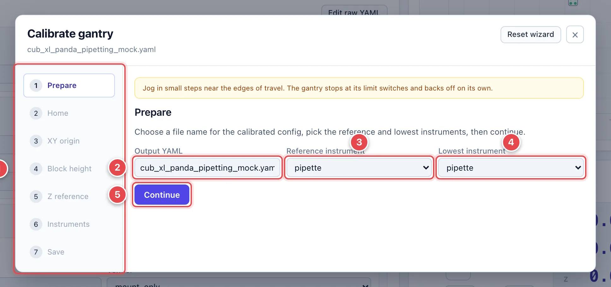
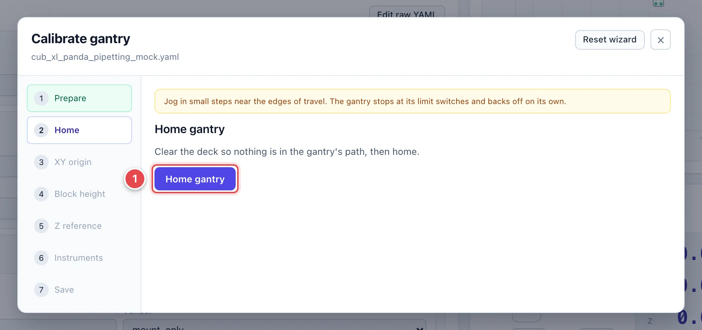
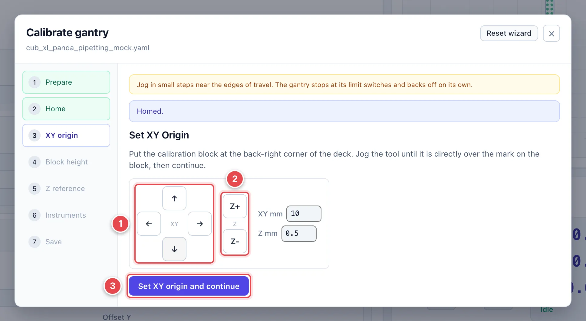
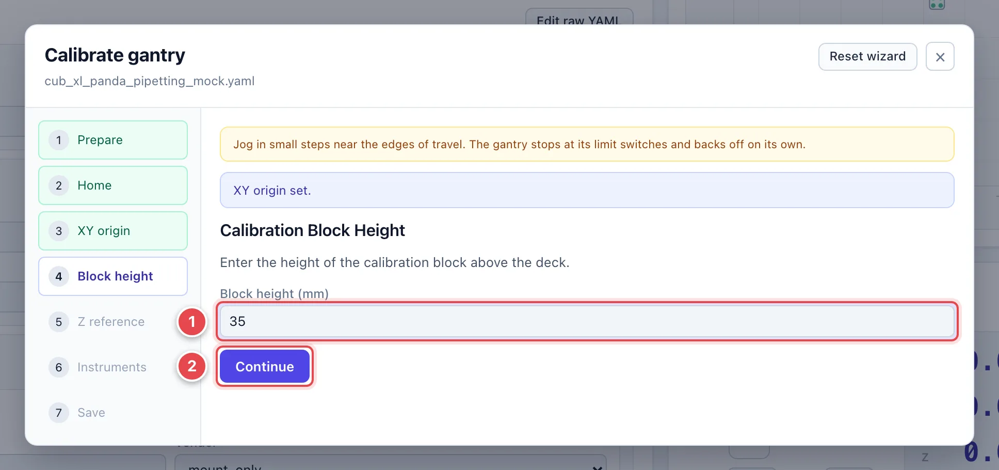
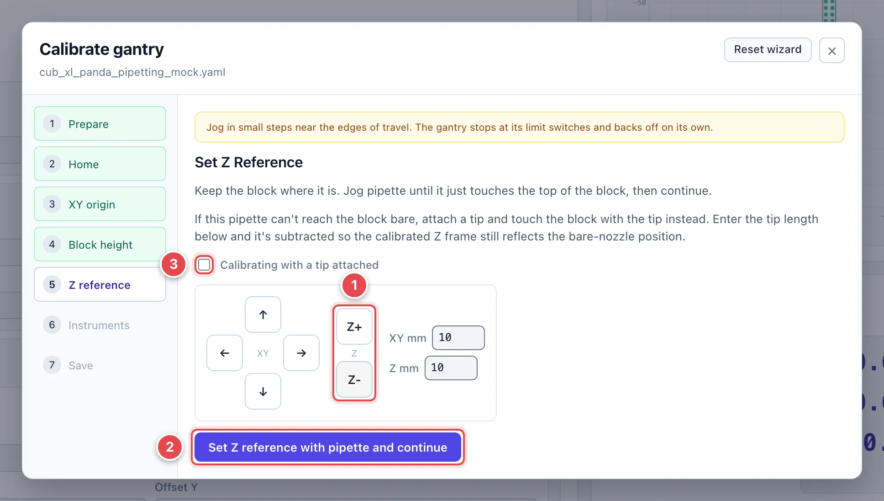
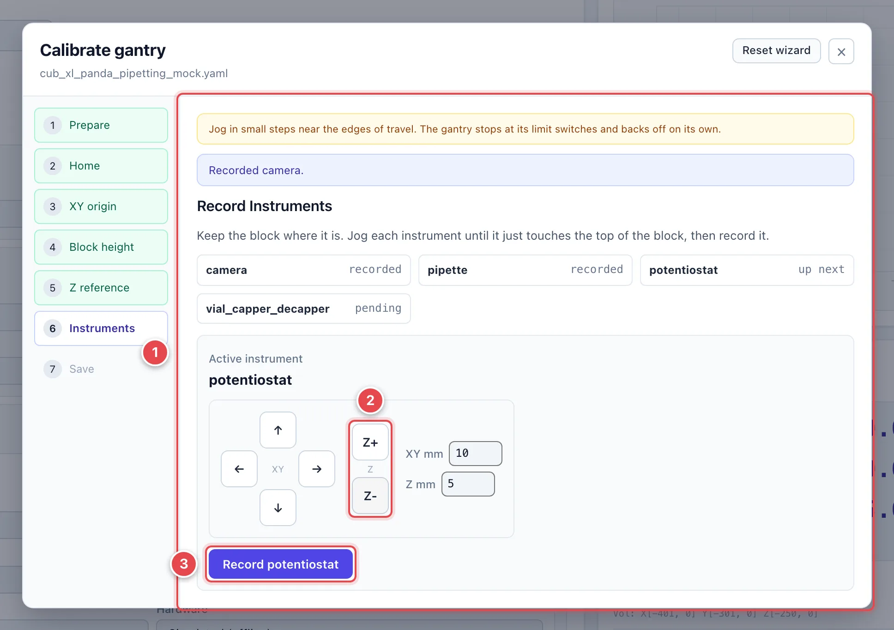
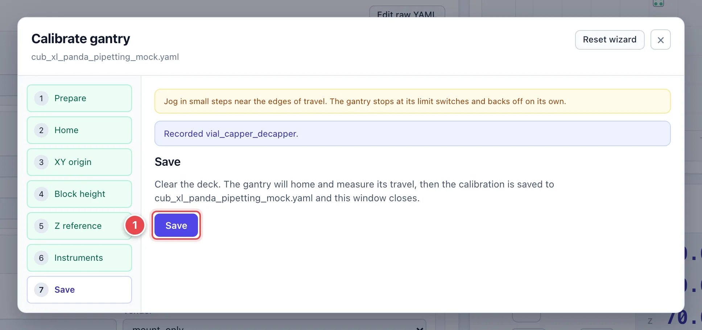

# Calibrate the Gantry

Gantry calibration tells CubOS where the deck's origin is and how far each
instrument's tip sits from the gantry head. Deck coordinates only mean
something once this is done. Run it when you first set up a machine, after
any crash or mechanical change, or whenever deck positions stop lining up
with reality.

The **Calibrate** button in Gantry Control opens a wizard that walks the
procedure described in [Calibrate Gantry](../calibration.md) one step at a
time. You need the gantry config loaded and a calibration block (or another
reference of known height) on the deck. The gantry does not have to be
connected before you open the wizard, but it must be before you leave the
first step.

!!! warning
    Soft limits are switched off while the wizard runs, so nothing stops
    you from driving into the frame. Jog in small steps near the edges of
    travel. The wizard's own banner reminds you of this on every step.

## Step 1: Prepare

1. **Step list.** The wizard has seven steps on a multi-instrument machine
   (five on a single-instrument one, which skips the block and Z-reference
   steps). Completed steps turn green.
2. **Output YAML.** The filename the calibrated config is saved to. It
   defaults to the loaded file; type a new name to keep the original.
3. **Reference instrument.** The instrument you will jog over the origin
   mark. Its tip defines XY zero.
4. **Lowest instrument.** The instrument that reaches lowest on the head.
   Its touch on the block defines Z zero, so the others are recorded
   relative to it.
5. **Continue.**

## Step 2: Home

1. **Home gantry.** Clear the deck so nothing is in the gantry's path, then
   click. The wizard moves on by itself when homing finishes.

## Step 3: Set the XY Origin

Put the calibration block at the back-right corner of the deck.

1. **XY jog pad.** Jog the reference instrument until it is directly over
   the mark on the block. Raise **XY mm** for the long approach and drop it
   back to 0.5 or less for the final alignment.
2. **Z jog.** Lower the head enough to sight the tip against the mark
   precisely, but keep clear of the block.
3. **Set XY origin and continue.** Records this XY as the deck origin.

## Step 4: Block Height

1. **Block height (mm).** The height of the calibration block above the
   deck surface. It is subtracted so Z zero lands on the deck, not on top of
   the block.
2. **Continue.**

## Step 5: Set the Z Reference

Keep the block where it is.

1. **Z jog.** Lower the lowest instrument until it just touches the top of
   the block. Use 0.1 mm steps for the last part; back off and re-approach
   if you overshoot.
2. **Set Z reference … and continue.** Records this Z. The wizard refuses
   the click if the head has not moved below the homed height.
3. **Calibrating with a tip attached.** If the pipette cannot reach the
   block bare, attach a tip, touch the block with the tip, and tick this
   box. A **Tip length (mm)** field appears; the length is subtracted so
   the calibrated Z still reflects the bare nozzle.

## Step 6: Record Instruments

Every mounted instrument is recorded in turn, block still in place.

1. **Instrument status.** One chip per instrument: **recorded**,
   **up next**, or **pending**. The wizard advances through them in order.
2. **Z jog.** Jog the active instrument down until it just touches the top
   of the block.
3. **Record …** Stores the position and moves to the next instrument. For a
   camera, which cannot touch the block, the wizard shows the live preview
   with a crosshair and asks for the **Distance from calibration block
   (mm)** instead of a touch.

## Step 7: Save

1. **Save.** Clear the deck first. The gantry homes again and measures its
   travel, then the calibration is written to the output file and the
   window closes. If you saved under a new name, the UI switches the loaded
   gantry config to it and reconnects.

The **Reset wizard** button at the top starts over from Prepare without
saving anything; **×** closes the window and discards the in-progress
calibration.
