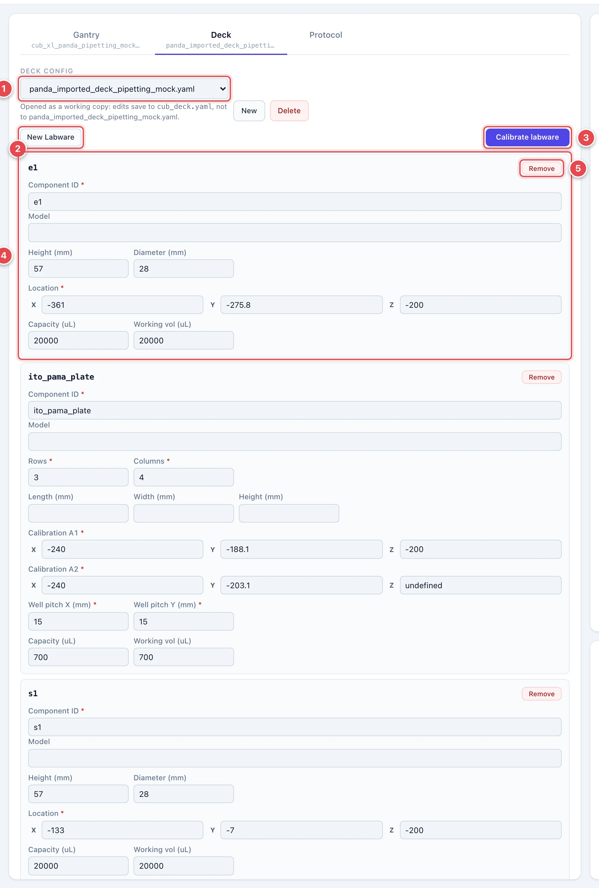
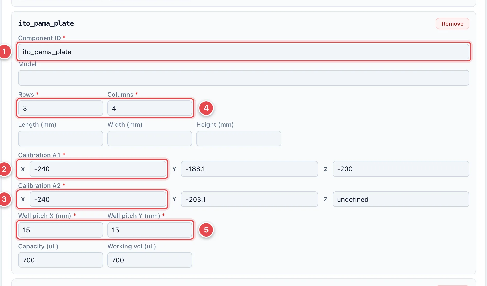
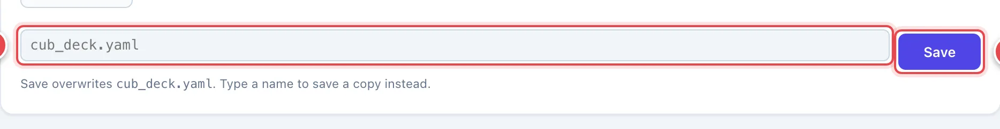
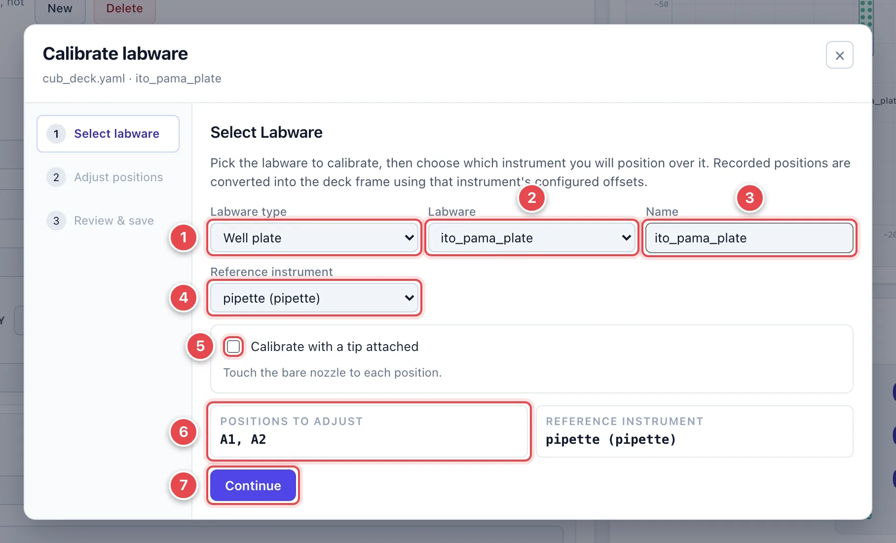
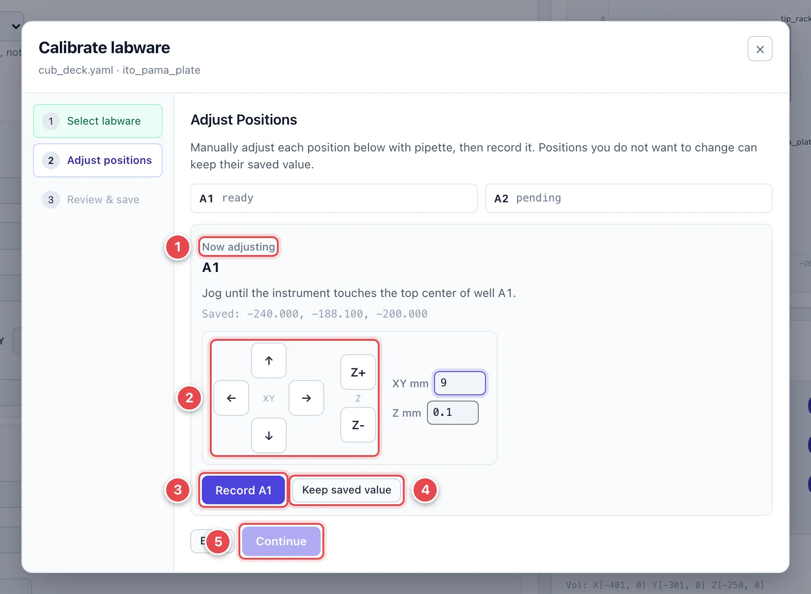
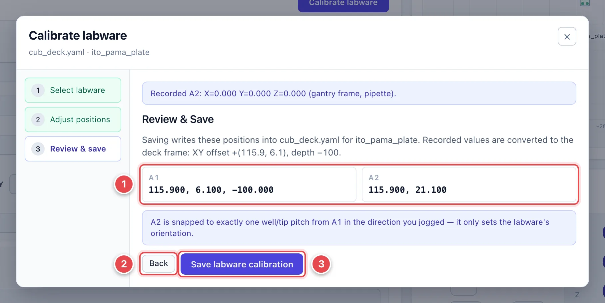

# Deck and Labware

The deck file tells CubOS what labware sits on the deck and where. This page
shows how to load and edit one in the **Deck** tab, and how to calibrate a
piece of labware's position by jogging the gantry to it.

Before you calibrate labware the gantry itself must be
[calibrated](calibrate-gantry.md) — deck coordinates only mean something once
the machine's origin is set — and the labware must be seated firmly in a spot
where it cannot shift.

## The Deck Tab

1. **Deck config.** Pick a deck file. The UI opens it as a **working copy**:
   edits save to `cub_deck.yaml` in the config directory, and the file you
   picked is left untouched. The note under the dropdown says so.
2. **+ Well Plate / + Vial.** Add a new labware entry of that type to the
   bottom of the list.
3. **Calibrate labware.** Opens the labware calibration dialog, covered
   [below](#calibrate-labware-with-the-gantry). It is enabled once both a
   gantry and a deck are loaded and no protocol is running.
4. **Labware card.** One card per entry, keyed by its deck name. The fields
   depend on the type — here a single vial with a location, height,
   diameter, and volume tracking.
5. **Remove.** Deletes that entry from the working copy.

Other labware types — vial grids, tip racks, tip disposals, and plate
holders — get their own field sets. Types the editor does not know are
passed through unchanged when you save.

### Well plate fields

1. **Component ID.** The name protocols use to address the plate. Wells are
   `plate.A1`, `plate.B2`, and so on.
2. **Calibration A1.** Deck-frame coordinates of the center of well A1, at
   the height where the instrument tip just touches the labware's reference
   surface.
3. **Calibration A2.** Coordinates of the next well along the same row. A1
   and A2 together tell CubOS which way the plate is oriented, so A2 must
   sit exactly one well pitch from A1 along one axis.
4. **Rows / Columns.** The plate's grid.
5. **Well pitch X / Y.** Center-to-center spacing in millimeters — 9 mm in
   both directions for a standard 96-well SBS plate.

You can type coordinates here by hand (jog to the well, read the numbers off
the Gantry Control readout, and enter them), but the calibration dialog
below does the reading, the frame conversion, and the A2 snap for you.

### Save the deck

1. **Filename.** Defaults to the working copy. Type another name to save a
   copy instead; the line underneath tells you which file will be written.
2. **Save.** Writes the file and redraws the Deck Visualization at the
   labware's real positions.

!!! note
    The amber **Unsaved changes** banner means your edits exist only on
    screen. Protocol runs use the saved file, so always save the deck
    before running.

A quick sanity check after saving: use **Move To** to send the head to a
labware's A1 coordinates and confirm the **HEAD** crosshair lands on the
plate's back-left well in the picture — and on the real plate's A1 on the
bench.

For what every field means — orientation rules, vial grids, aliases, and
volume tracking — see [Set Up Deck and Labware](../deck.md).

## Calibrate Labware with the Gantry

This is how you tell CubOS where a plate, vial, or rack physically sits:
**drive the instrument to the spot and record the position**. No measuring
tape involved. Click **Calibrate labware** in the Deck tab to open the
dialog.

### 1. Select labware

1. **Labware type.** Well plate, vial, vial grid, tip rack, tip disposal,
   or a holder.
2. **Labware.** Either an entry already on the deck, or **Add new** from a
   built-in template (96- and 384-well SBS plates, 24- and 6-well plates, a
   96-tip rack, a 20 mL scintillation vial) to create one.
3. **Name.** Renames an existing entry or names a new one.
4. **Reference instrument.** The instrument you will position over the
   labware. Recorded positions are converted into the deck frame using that
   instrument's configured XY offset and depth, so pick the one you will
   actually be looking at.
5. **Calibrate with a tip attached.** For a pipette: tick this if a tip is
   on, and enter its length so it is subtracted from the recorded Z.
6. **Positions to adjust.** What the next step will ask you to record —
   for a plate, A1 and A2; for a vial, its top center; for a tip rack, A1,
   A2, and the drop position.
7. **Continue.**

### 2. Adjust positions

1. **Now adjusting.** Which position is being recorded, with a hint on
   where to put the tip (for A1, the top center of the well) and the
   currently saved value.
2. **Jog pad.** Jog the reference instrument until the tip touches that
   spot. Creep up with small steps; the last approach in Z should be 0.1 mm
   at a time.
3. **Record …** Captures the gantry's current position for that target and
   moves on to the next one.
4. **Keep saved value.** Skips this target and leaves the saved coordinate
   as it is.
5. **Continue.** Enabled once every target is recorded or kept.

For A2, jog one well over from A1 along the row and record. The dialog
snaps A2 to exactly one pitch from A1 in the direction you jogged — A2 only
sets the labware's orientation, so it does not need to be measured
precisely.

### 3. Review and save

1. **Converted positions.** The recorded values after conversion into the
   deck frame (the text above them shows the offset and depth that were
   applied). Targets you kept are marked unchanged.
2. **Back.** Return to re-record a position.
3. **Save labware calibration.** Writes the positions into the working deck
   file. Tip racks also get their pickup and drop heights shifted by the
   same amount; holders move their nested labware with them.

After saving, the Deck Visualization redraws and the deck editor picks up
the new values. The deck file is already saved at this point — no further
**Save** click is needed.
