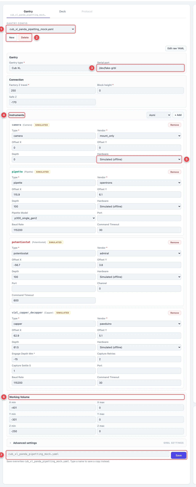
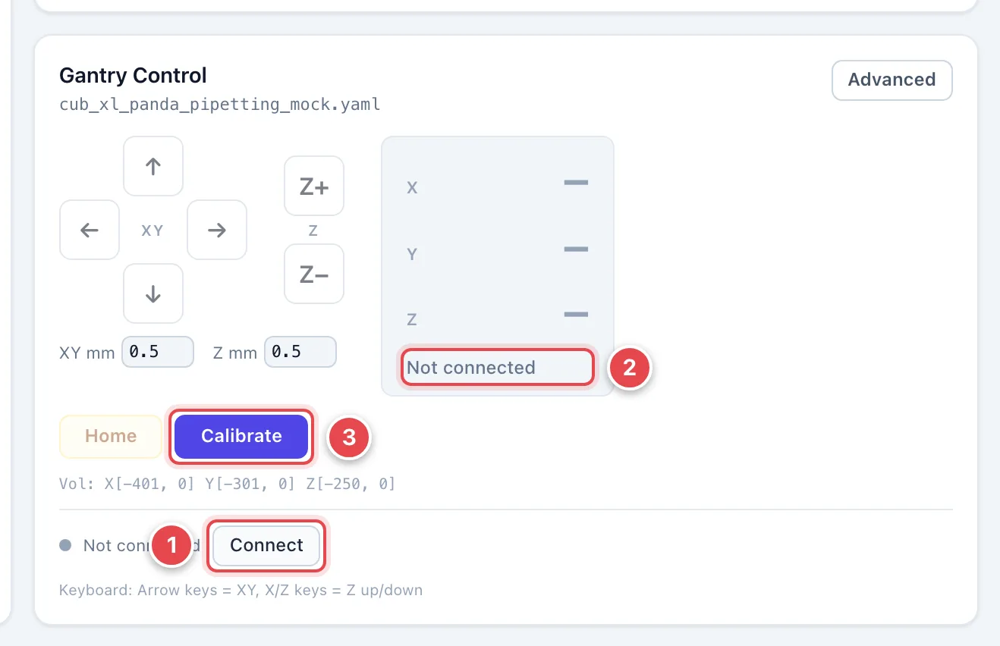
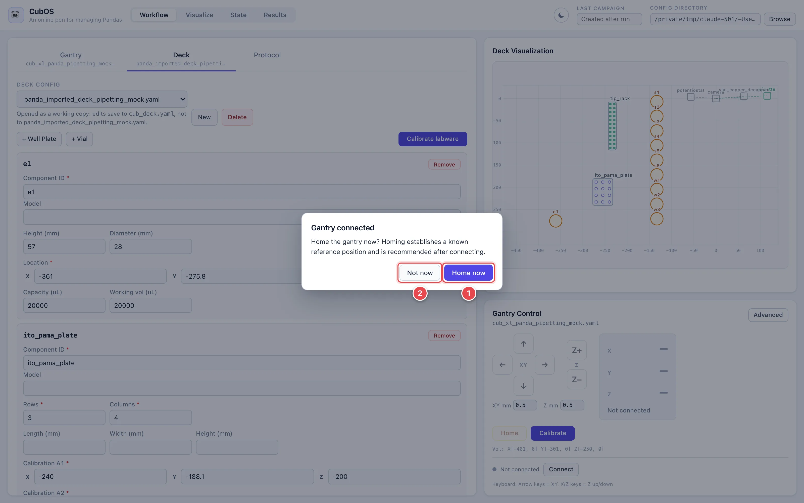
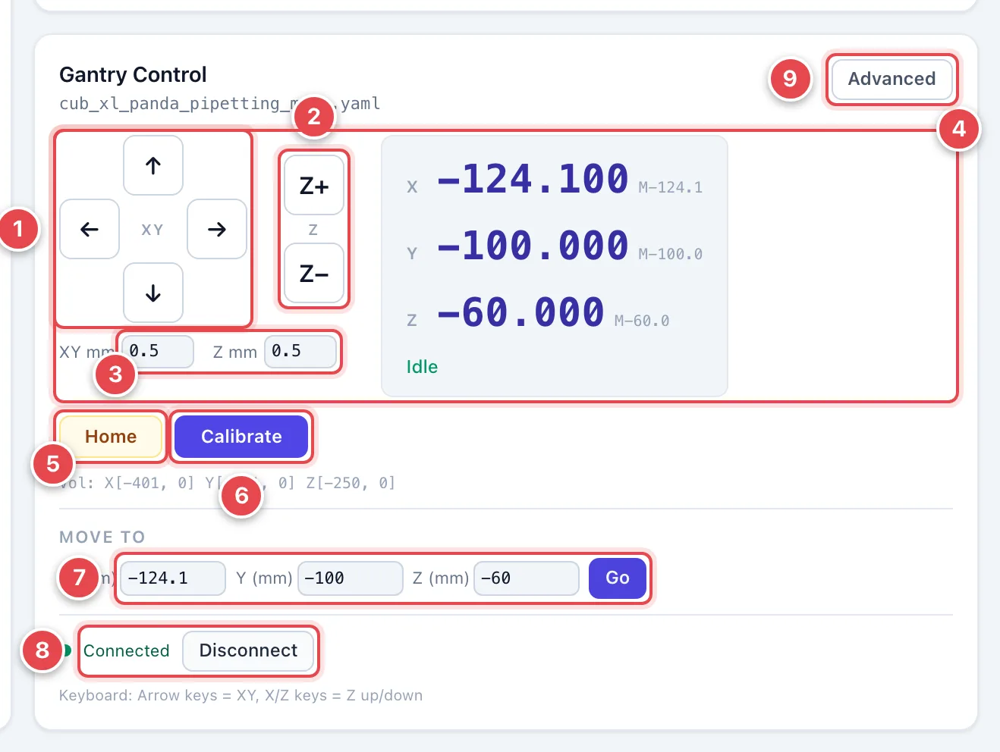

# Gantry: Connect and Move

This page covers the first things you do in every session: load the machine
config, connect to the gantry, home it, and move it by hand.

## Load the Gantry Config

Open the **Workflow** view and the **Gantry** tab.

1. **Gantry config.** Pick your machine's file (for example `cub_seed.yaml`).
   The editor fills in with that machine's settings.
2. **New / Delete.** Start an empty gantry config, or delete the one that is
   open. Delete is disabled while the gantry is connected.
3. **Serial port.** Leave it blank to let CubOS scan for the gantry
   automatically, or enter the port name if you know it — `/dev/ttyUSB0` on
   Linux, `COM3` on Windows.
4. **Instruments.** One card per mounted instrument with its type, vendor,
   XY offset from the gantry head, and depth. Use the dropdown and **+ Add**
   on the right of the heading to mount another one.
5. **Hardware.** Each instrument can run as **Connected** or
   **Simulated (offline)**. Simulated instruments skip hardware I/O and
   return synthetic data, which is how you dry-run a protocol without the
   instrument attached. The card shows a **SIMULATED** badge while it is
   offline.
6. **Working Volume.** The machine's travel limits. Every move is checked
   against these before it is sent.
7. **Save.** The filename box defaults to the open file; type a new name to
   save a copy instead. Saving is what the gantry connection and protocol
   runs actually read.

For what every field means, see [Set Up Gantry YAML](../gantry-setup.md).

## Connect and Home

!!! warning
    Homing and jogging move real hardware. Before you connect, clear loose
    items from the deck, check that cables and fixtures are out of the
    travel path, and keep the E-stop within reach.

Make sure the gantry is powered on and its USB cable is plugged into this
computer, and close Candle, Universal Gcode Sender, or any other program
that talks to the gantry — only one program can hold the serial port at a
time.

{ width="560" }

1. **Connect.** Opens the serial port named in the gantry config (or scans
   for one). The button reads **Select config first** until a gantry file is
   loaded.
2. **Not connected.** The readout shows dashes instead of coordinates until
   the connection is up.
3. **Calibrate.** Opens the calibration wizard, covered on
   [Calibrate the Gantry](calibrate-gantry.md).

As soon as the connection is up, the UI asks whether to home:

1. **Home now.** Drives each axis to its end stops to establish a known
   reference position. Always home after connecting.
2. **Not now.** Skips homing for now. You can home later with the **Home**
   button in Gantry Control.

Once homing finishes the status dot turns green with **Connected**, the
readout shows real coordinates, and the status line reads **Idle**.

## Move the Gantry

With the gantry connected and homed, **Gantry Control** gives you three ways
to move it.

{ width="560" }

1. **XY jog pad.** Each click moves the head by the **XY mm** step. Hold a
   button down to keep moving. Directions follow the CubOS deck convention:
   **→** is +X (toward the operator's right), **↑** is +Y (away from you,
   toward the back).
2. **Z jog.** **Z+** raises the head, **Z−** lowers it, by the **Z mm** step.
3. **Step sizes.** How far one click moves, in millimeters. 0.5 mm is the
   default.
4. **Position readout.** The current work position in millimeters, with the
   machine coordinate in small type beside it. The line under the numbers is
   the controller state: **Idle** in green means ready; **Jog** or **Run**
   in blue means moving; a red **ALARM** banner means the controller has
   locked itself.
5. **Home.** Re-homes all axes.
6. **Calibrate.** Opens the calibration wizard.
7. **Move To.** Type exact X, Y, Z coordinates and click **Go**. The
   allowed range for each axis is shown in gray inside the box, and the
   **Vol** line above lists the working volume. Targets outside it are
   refused with an explanation.
8. **Connection.** The status dot and **Disconnect** button.
9. **Advanced.** Reveals GRBL-level controls: read and change controller
   settings, feed hold and resume, cancel a jog, reset and unlock, and
   pull off a limit switch. Use these when the
   [troubleshooting guide](../troubleshooting.md) tells you to.

**Keyboard.** Click anywhere outside a text box first, then use the arrow
keys for X/Y and the `X` / `Z` keys for Z up / Z down. Same step sizes as
the buttons.

!!! note
    Start with small steps. 0.5 mm per click is a safe default when you are
    close to labware; raise **XY mm** to 5–10 for long moves across the
    deck, and switch back down before your final approach.

If a red **ALARM** banner appears (for example after hitting a limit
switch), click **Unlock ($X)**, jog back toward the middle of the deck, and
re-home. See [Troubleshooting & Recovery](../troubleshooting.md) for the
full recovery procedure.
