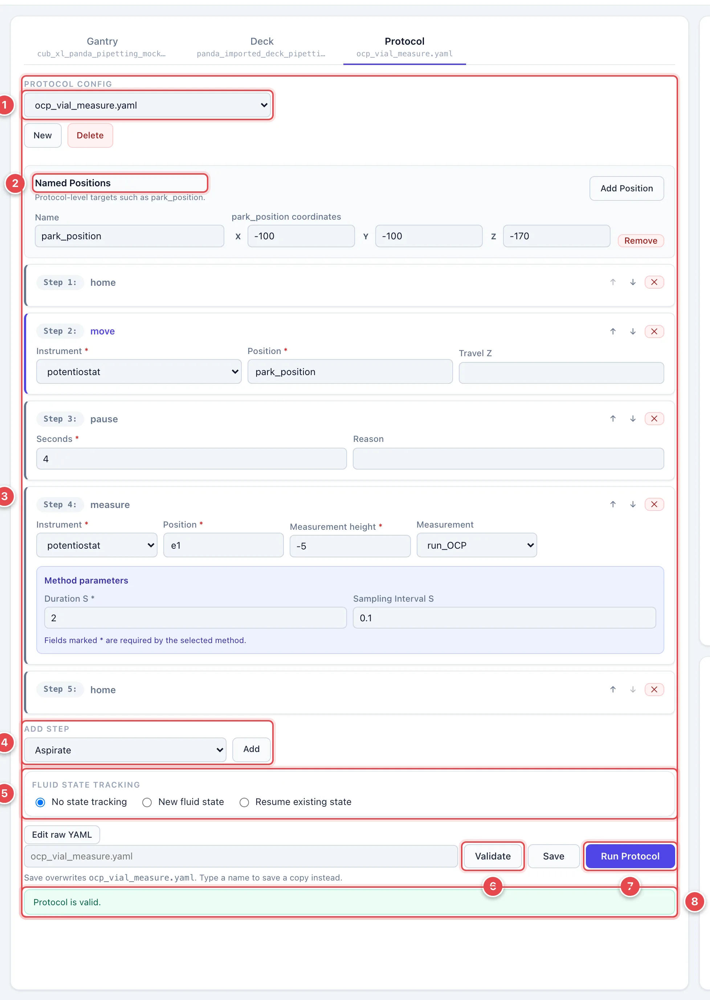
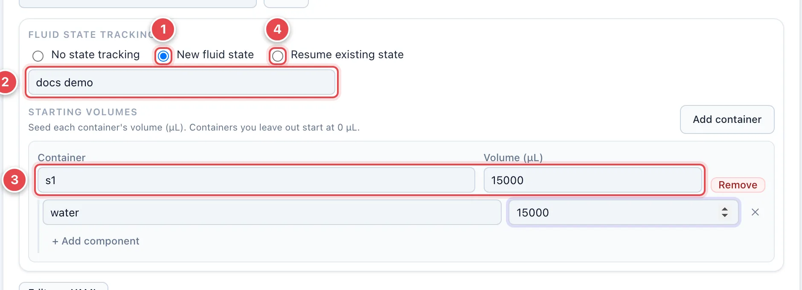
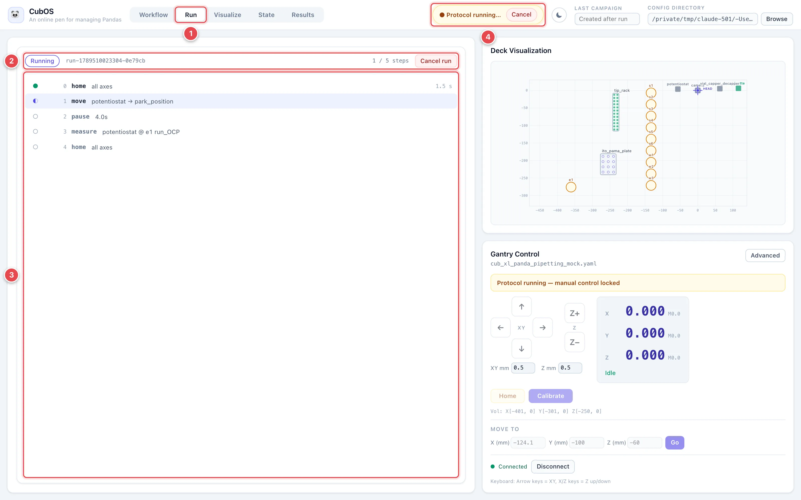
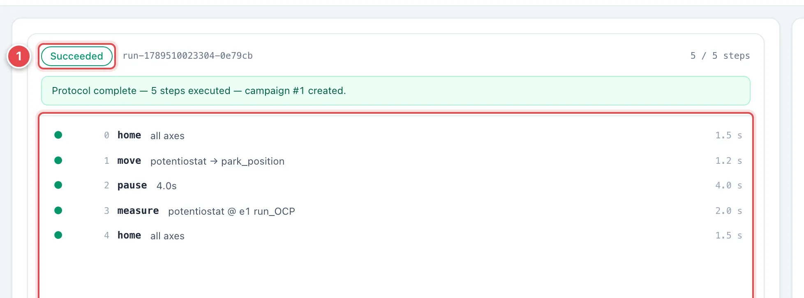

# Protocols

A protocol is a list of steps — home, move, measure, pipette, pause — that
CubOS executes against the loaded gantry and deck. This page shows how to
build one in the **Protocol** tab, validate it without moving anything, run
it, and watch it progress.

The **Protocol** tab unlocks once a gantry and a deck config are loaded.
Running also needs the gantry connected.

## The Protocol Tab

1. **Protocol config.** Pick a protocol file, or click **New** to start an
   empty one.
2. **Named Positions.** Protocol-level XYZ targets such as a park position.
   Steps refer to them by name. **Add Position** adds a row.
3. **Step cards.** One card per step, in run order. Each shows the command
   and its parameters — here a `measure` step naming the instrument, the
   deck position (`e1`, a vial's Component ID), the measurement height
   relative to the labware surface, and the instrument method with its own
   parameters. Fields marked `*` are required by that command or method.
   The arrows on the right reorder steps; **×** removes one.
4. **Add step.** Choose a command and click **Add** to append a card.
   Positions are addressed by the Component IDs from your deck file
   (`plate.A1`) or by named positions.
5. **Fluid state tracking.** Whether this run records liquid volumes, tips,
   and caps. See [below](#track-liquid-state-across-runs).
6. **Validate.** Checks the saved protocol against the saved gantry and deck
   files without moving anything: every target must resolve, every move
   must stay inside the working volume once the instrument's offset and
   depth are applied, and every instrument method must exist.
7. **Run Protocol.** Starts the run. Disabled while any editor has unsaved
   changes — runs use the saved files, not what is on screen.
8. **Validation result.** A green **Protocol is valid.** banner, or a red
   list of what failed and why.

**Edit raw YAML** above the save row opens the file as text, for anything
the form does not expose. See
[Run a Protocol with YAML](../protocol-yaml.md) for the full command
reference.

## Track Liquid State Across Runs

Pipetting protocols can keep a durable record of what is in every container,
which tips have been used, and which vials are capped. Pick a mode under
**Fluid state tracking** before running.

1. **New fluid state.** Start a fresh record for this run.
2. **Label.** An optional name for the new state so you can find it later.
3. **Starting volumes.** Seed each container that is not empty: its
   Component ID and volume in µL, optionally broken down by component.
   Containers you leave out start at 0 µL. Transfers that would overdraw a
   source or overflow a destination are rejected before any motion.
4. **Resume existing state.** Continue from a state saved by an earlier
   run, so volumes and consumed tips carry over.

**No state tracking** runs without recording any of this. See
[Fluid State Tracking](../fluid-state.md) for how the record is stored and
resumed.

## Run and Watch

Click **Run Protocol**. The UI switches to the **Run** view, which stays
available for the rest of the session so you can come back to it.

1. **Run tab.** Appears in the view switcher once a run exists.
2. **Run header.** The run state (**Queued**, **Running**, then
   **Succeeded**, **Failed**, or **Cancelled**), the run ID, a step counter,
   and **Cancel run**.
3. **Step list.** Every step in the plan, with its status: a filled dot for
   done, a half dot for the step in progress, an empty ring for pending.
   Finished steps show how long they took; a failed step shows its error
   inline.
4. **Protocol running banner.** Shown in the header on every view while the
   run is active, with its own **Cancel** button. Manual gantry controls are
   locked until the run ends.

Cancelling sends a feed hold to the controller, so motion stops at once and
the run ends as **Cancelled**. A pipette holding liquid keeps it rather than
dispensing on abort.

1. **Outcome.** The state pill turns green on success, and the banner under
   it reports the step count and the campaign number that was created.
2. **Completed steps.** Every step with its duration.

When the run completes, its measurements appear in the **Results** view as
a new campaign, and any tracked liquid volumes are in the **State** view.
See [Results and State](results-and-state.md).
