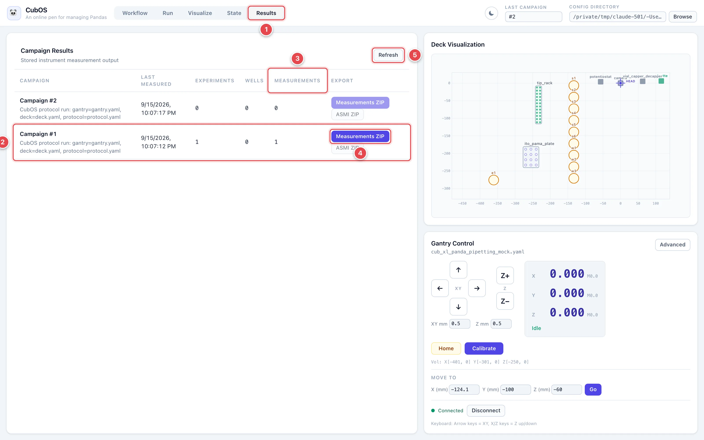
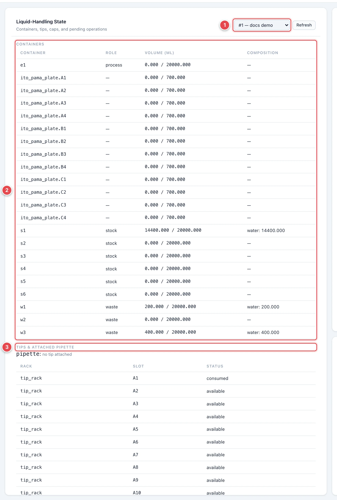
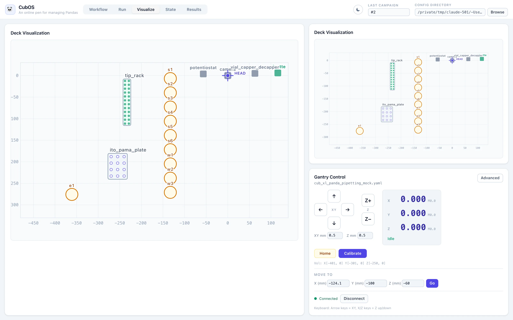

# Results and State

Two views collect what a protocol run leaves behind: **Results** holds the
instrument measurements, grouped into campaigns; **State** holds the
liquid-handling record. **Visualize** is a full-size copy of the deck map.

## Get Results

Every protocol run creates a campaign in the CubOS database, and every
`measure` or `scan` step stores its instrument output in it. Open the
**Results** view to see them.

1. **Results tab.**
2. **Campaign row.** One per run, newest first, with the run's description
   and when it last recorded a measurement.
3. **Measurements.** How many instrument measurements the campaign holds.
   Motion-only runs show 0 and their export buttons stay disabled.
4. **Measurements ZIP.** Downloads every measurement in the campaign as
   CSV files in one archive. **ASMI ZIP** below it exports raw indentation
   traces for campaigns that have them.
5. **Refresh.** Re-reads the campaign list.

The **Last Campaign** box in the header shows the number of the campaign
created by the most recent run, so you can find it in this list.

For where the database lives, what each table holds, and how to export from
the command line, see [Data](../data.md).

## Inspect Liquid State

If a run used **New fluid state** or **Resume existing state** (see
[Protocols](protocols.md#track-liquid-state-across-runs)), the **State** view
shows the resulting record.

1. **Fluid state.** Pick which saved state to inspect. Each is listed by
   number and label.
2. **Containers.** Every container on the deck with its role, current
   volume against its working volume, and composition. Here the stock vial
   `s1` was seeded with 15 000 µL of water and two transfers moved 200 µL
   and 400 µL into the waste vials.
3. **Tips and attached pipette.** Whether a tip is currently on the
   pipette, and each tip-rack slot's status: **available**, **consumed**,
   or uncertain.

Further down, **Caps** lists cap state for capper-managed vials, and the
footer reports any pending operations — steps that were interrupted
mid-way. When an interrupted operation leaves the physical state uncertain,
a **Resolution** form appears so an operator can confirm whether the
operation was applied and reconcile the record. See
[Fluid State Tracking](../fluid-state.md#interrupted-operations).

## Visualize the Deck

The **Visualize** view shows the same deck map as the right-hand panel,
scaled up to the full left panel. Labware is drawn at its calibrated
position, instruments are drawn around the head, and the **HEAD** crosshair
follows the live gantry position. It is useful on a small screen, or when
you want to watch a run without the editors in the way.

