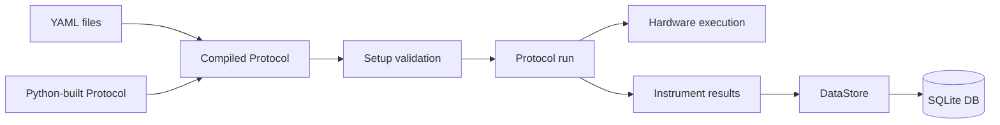

# Running a Protocol

A protocol run loads gantry, deck, and protocol YAML, compiles the protocol
steps, validates the resulting motion plan, then executes against hardware.



## Architecture

- `protocol_engine.loader.load_protocol_from_yaml()` parses protocol YAML and
  compiles each step into a `ProtocolStep`.
- `protocol_engine.setup.setup_protocol()` loads gantry and deck YAML, builds
  the instrumented gantry, validates bounds and semantics, and returns
  `(Protocol, ProtocolContext)`.
- `setup/validate_setup.py` runs the same offline validation path without
  contacting hardware.
- `setup/run_protocol.py` validates first, connects the gantry and
  instruments, runs the protocol, and disconnects in `finally`.

Data is written only when a `DataStore` and `campaign_id` are attached to
the `ProtocolContext`. The stock `setup/run_protocol.py` command focuses on
hardware execution and does not create a campaign automatically.

## Validate Before Hardware

Run setup validation before connecting hardware:

```bash
PYTHONPATH=src python setup/validate_setup.py \
  configs/gantry/cub_xl_asmi.yaml \
  configs/deck/asmi_deck.yaml \
  configs/protocol/asmi/move_a1.yaml
```

Validation checks:

- gantry, deck, instrument, and protocol YAML load correctly
- protocol targets are inside the gantry working volume
- mounted instruments can reach the commanded areas
- configured fixed-structure guards, such as the `cub_xl` right rail, are not
  hit by known target points or travel segments
- command semantics are valid, including required height fields and pipette
  tip state

Offline validation reduces risk, but it does not prove real-world clearance.
Confirm physical fixture, cable, tool, and sample clearance before running.

## Run From YAML

After calibration, jog checks, and offline validation, run a protocol with:

```bash
PYTHONPATH=src python setup/run_protocol.py \
  configs/gantry/cub_xl_asmi.yaml \
  configs/deck/asmi_deck.yaml \
  configs/protocol/asmi/move_a1.yaml
```

`setup/run_protocol.py` performs these phases:

1. Offline setup validation.
2. Hardware gantry construction from the gantry YAML.
3. `setup_protocol(..., gantry=real_gantry)` to re-load and re-validate.
4. Gantry connection and startup alarm preparation.
5. Instrument connection.
6. Sequential protocol execution.
7. Instrument and gantry disconnect in cleanup.

## Python API

`protocol_engine.setup.run_protocol()` is useful for tests and custom
orchestration. If no `gantry` argument is supplied, it builds an offline
`Gantry` for validation/execution against mock motion, not a connected
controller.

```python
from protocol_engine.setup import run_protocol

results = run_protocol(
    "configs/gantry/cub_xl_asmi.yaml",
    "configs/deck/asmi_deck.yaml",
    "configs/protocol/asmi/move_a1.yaml",
)
```

Use `setup_protocol()` when you need to inspect or customize the context before
running. Attach a `DataStore` and `campaign_id` when you want command handlers
to persist measurements:

```python
from data import DataStore
from protocol_engine.setup import setup_protocol

store = DataStore("runs/example.db")
campaign_id = store.create_campaign(
    "ASMI indentation run",
    gantry_config="configs/gantry/cub_xl_asmi.yaml",
    deck_config="configs/deck/asmi_deck.yaml",
    protocol_config="configs/protocol/asmi/indentation.yaml",
)

protocol, context = setup_protocol(
    "configs/gantry/cub_xl_asmi.yaml",
    "configs/deck/asmi_deck.yaml",
    "configs/protocol/asmi/indentation.yaml",
    data_store=store,
    campaign_id=campaign_id,
)

results = protocol.run(context)
store.close()
```

For real hardware in custom Python code, mirror `setup/run_protocol.py`:
construct `Gantry(config=...)`, connect it, call `prepare_for_protocol_run()`,
pass it into `setup_protocol(..., gantry=gantry)`, connect instruments, run,
and disconnect in cleanup.

## Protocol Commands

| Command | Description |
| --- | --- |
| `home` | Home the gantry without redefining calibrated deck-origin WPos. |
| `move` | Move to a named XYZ, literal XYZ, or deck target. `travel_z` applies only to named/literal XYZ targets. |
| `measure` | Move to a deck position, descend to `well.z + measurement_height`, call an instrument method, and optionally persist the result. |
| `scan` | Iterate a well plate row-major, using `interwell_scan_height` between wells and `measurement_height` for action. |
| `pause` | Sleep for `seconds`. |
| `breakpoint` | Wait for operator input. |
| `pick_up_tip` | Pick up a tip from a `tip_rack` slot and mark it consumed. |
| `aspirate`, `transfer`, `serial_transfer`, `mix`, `blowout`, `drop_tip` | Pipette liquid-handling operations. |

Deck targets can be top-level labware such as `plate.A1` or nested paths such
as `plate_holder.plate.A1`. `scan.plate` accepts a top-level or nested target
that resolves to a `WellPlate`.

## Height Semantics

`measurement_height`, `interwell_scan_height`, `indentation_limit_height`,
and pipette engagement heights are labware-relative offsets from the resolved
labware reference Z. Positive is above the surface; negative is below.

The gantry's `safe_z` is different: it is an absolute deck-frame Z used for
inter-labware travel and first-well scan entry.
