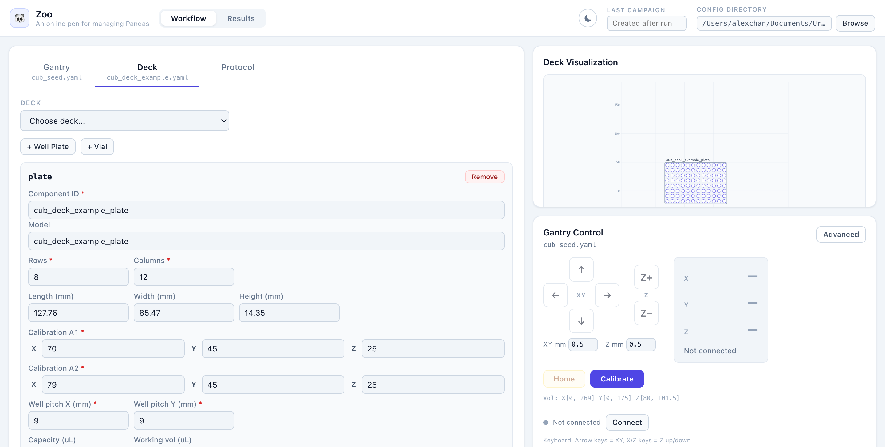

# CubOS API

`cubos_api` is the local FastAPI service for a CubOS appliance. It serves the
compiled operator web application and exposes one versioned `/api/v1` contract
to both the browser and the Python SDK.

Runtime behavior stays in `packages/core/`: configuration validation, deck
math, protocol execution, movement, calibration primitives, instrument access,
and data storage are all provided by the installed `cubos` package.



## Install and run

From the monorepo root:

```bash
python -m venv .venv
source .venv/bin/activate
pip install -e "packages/core[asmi]"
pip install -e "services/api[dev]"

cd apps/operator-web
npm ci
npm run build
cd ../..

python -m cubos_api
```

The development server defaults to `127.0.0.1:8742`. It serves the operator web
build from `apps/operator-web/dist/` and uses `services/api/configs/` as its
default config seed directory.

## API contract

The public API root is `/api/v1`.

| Resource | Purpose |
| --- | --- |
| `GET /api/v1/health` | Readiness without connecting to hardware |
| `GET /api/v1/version` | API, core, build, and image versions |
| `GET /api/v1/capabilities` | Installed commands and instrument vendors |
| `GET /api/v1/settings` | Active config and service settings |
| `POST /api/v1/runs` | Validate, persist, and start a protocol bundle |
| `GET /api/v1/runs/{run_id}` | Durable run state and results |
| `POST /api/v1/runs/{run_id}/cancel` | Request cancellation through CubOS |
| `GET /api/v1/data/campaigns` | Stored campaign summaries |

Run submission accepts either filenames in the configured directory or an
inline gantry, deck, and protocol bundle. The API returns `202 Accepted`; only
one run can own the hardware at a time.

## Configuration and state

Service settings use the `CUBOS_*` namespace. Important deployment settings
include:

- `CUBOS_API_TOKEN` or `CUBOS_API_TOKEN_FILE`
- `CUBOS_CONFIG_DIR`
- `CUBOS_RUN_DIR`
- `CUBOS_DATA_DB_PATH`
- `CUBOS_TRUSTED_HOSTS`
- `CUBOS_WEB_DIST`

User state defaults under `~/.cubos/`. Appliance images override these paths to
`/var/lib/cub/`. The API never caches a separate copy of CubOS runtime state.

## Repository map

| Path | Purpose |
| --- | --- |
| `src/cubos_api/app.py` | FastAPI application factory |
| `src/cubos_api/config.py` | `CUBOS_*` settings |
| `src/cubos_api/routers/` | Versioned HTTP routes |
| `src/cubos_api/services/` | YAML and durable run orchestration |
| `configs/` | Generic operator config seeds |
| `tests/` | API tests |
| `../../apps/operator-web/` | Browser client |
| `../../sdk/python/` | Python SDK and `cubos-send` |

## Validation

```bash
python -m pytest services/api/tests -q
cd apps/operator-web
npm run lint
npm run test -- --run
npm run build
```

These checks are hardware-safe. Connecting, homing, jogging, calibrating, and
running protocols require a separate operator-led hardware validation.
